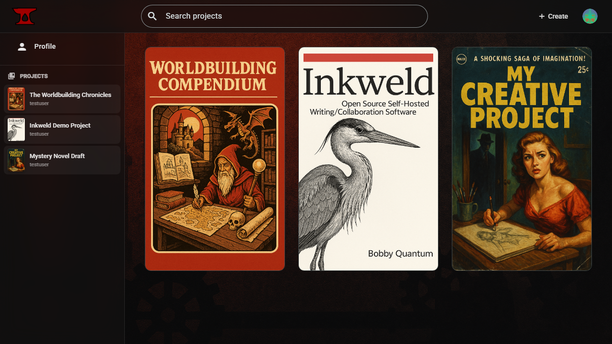
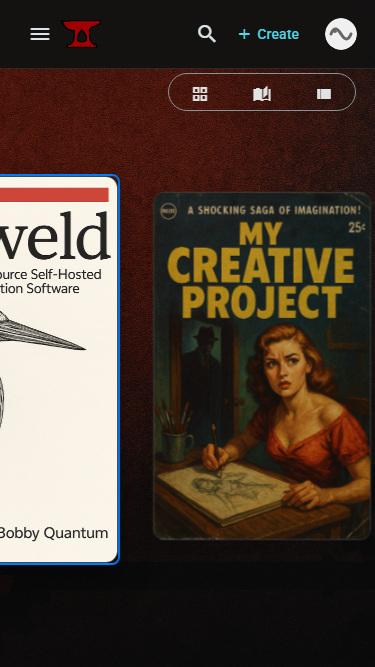
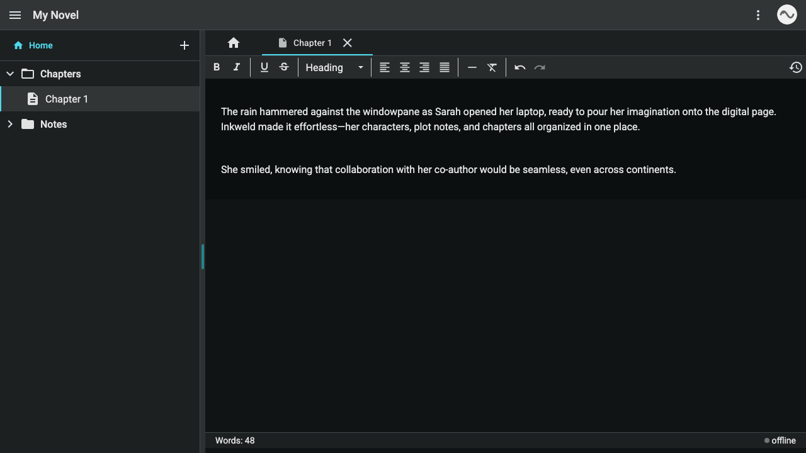
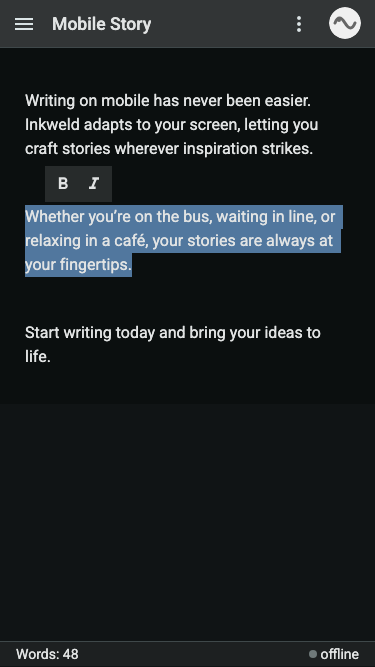

# Inkweld


[](LICENSE)
[](https://github.com/bobbyquantum/inkweld/actions)
[](https://hub.docker.com/)
[](https://github.com/bobbyquantum/inkweld/pkgs/container/inkweld)

---

**Quick Links:**  

- [Getting Started](docs/GETTING_STARTED.md)  
- [Changelog](CHANGELOG.md)  
- [API Documentation](backend/openapi.json)  
- [CI/CD Pipeline](docs/CI_CD.md)  
- [Contributing](#contributing)  
- [Production Readiness Checklist](#production-readiness-checklist)

---

## About

Inkweld is ideal for:

- **Creative Writing**: Collaborate on novels, short stories, and screenplays with real-time editing and version control
- **Worldbuilding**: Organize and develop fictional worlds with hierarchical document structures
- **Technical Documentation**: Maintain up-to-date documentation with multiple contributors
- **Research Projects**: Collaborate on academic papers and research notes

---

## Screenshots

### Project Bookshelf (Dark Mode)


*Desktop View*


*Mobile View*

### Project Editor (Dark Mode)


*Desktop Editor with Real-time Collaboration*


*Mobile Editor with Formatting Menu*

---

### Feature Overview

| Feature                        | Description                                                                 |
|---------------------------------|-----------------------------------------------------------------------------|
| Real-time Collaboration        | Edit documents with others in real time using YJS and Prosemirror           |
| Hierarchical Organization      | Organize projects and documents in nested structures                        |
| Offline Editing                | Work offline with automatic sync when reconnected                           |
| Rich Text Formatting           | Advanced formatting and styling options                                     |
| Version History                | Track changes and revert to previous versions                               |
| User Permissions               | Fine-grained access control and roles                                       |
| Extensible Integrations        | Add new features via MCP (Model Context Protocol) integrations              |
| Export Options                 | (Planned) Export to PDF, EPUB, Markdown, and print-friendly formats         |

---

## Architecture

```mermaid
flowchart TD
    Frontend[Angular 20 PWA] -->|REST + WebSocket| Backend[Hono API (Bun/Node/Workers)]
    Backend -->|Drizzle ORM| Database[(SQLite / D1)]
    Backend -->|Yjs persistence| Realtime[(LevelDB / Durable Objects)]
    Backend -->|OpenAPI spec| APIClient[Generated SDK]
    Frontend -.->|imports at build| APIClient
```

---

## Project Setup

> **Requirements:**  
>
> - [Bun 1.2+](https://bun.sh/)  
> - [NodeJS 20+](https://nodejs.org/en)

1. **Clone the repository:**

    ```bash
    git clone https://github.com/bobbyquantum/inkweld.git
    cd inkweld
    ```

2. **Install dependencies:**

    ```bash
    npm run install-all
    ```

    > This script installs dependencies for both the frontend and backend using the appropriate package managers.

3. **Set up environment variables:**

    - Copy `.env.example` to `.env` at the project root and update the values as needed.

4. **(Optional) Enable Angular MCP for AI Assistants:**

    This project includes an Angular CLI MCP (Model Context Protocol) server configuration that gives AI assistants direct access to real-time Angular documentation. The configuration is already set up in `.vscode/mcp.json`.
    
    **To activate it:**
    - Restart VS Code or your AI assistant after cloning the repository
    - The MCP server provides tools like `get_best_practices`, `search_documentation`, and `list_projects`
    - Learn more at https://angular.dev/ai/mcp

> There are VSCode workspaces available. For general development or trying it out, it's recommended to load the full workspace with backend and frontend folders configured.

---

## Development Server

To start the development server (both frontend and backend):

```bash
npm start
```

There is also a compound debug task available.

### Backend Runtime Targets

The new `/backend` implementation can run in three environments:

| Target | Command | Notes |
| --- | --- | --- |
| Bun (default) | `cd backend && bun run dev` | Native `bun:sqlite`, WebSockets + Yjs |
| Node.js | `cd backend && bun run dev:node` | Uses `better-sqlite3`, great for traditional servers |
| Cloudflare Workers | `cd backend && bun run dev:worker` | Uses D1 + Durable Objects |

Production builds follow the same pattern via `bun run build`, `bun run build:node`, or `bun run build:worker`.

---

## Build

To build the project:

```bash
npm run build
```

- Frontend build artifacts: `frontend/dist/`
- Backend build artifacts: `backend/dist/`
- Backend binaries are runtime-specific (`dist/bun-runner.js`, `dist/node-runner.js`)

---

## Docker Compose

To build and run with Docker Compose:

```bash
npm run compose:up:prod
```

This uses the root `Dockerfile` to build the all-in-one image (Angular SPA + Hono backend compiled into a single Bun binary) and persists SQLite/Yjs data in the `inkweld_data` volume. On boot the container automatically runs Drizzle migrations so the SQLite schema is ready before requests arrive. See `DEPLOY.md` for production deployment options.

---

## Docker Images

Pre-built Docker images are automatically published to GitHub Container Registry:

- **Latest (main branch)**: `ghcr.io/bobbyquantum/inkweld:latest`
- **Specific commit**: `ghcr.io/bobbyquantum/inkweld:main-<commit-sha>`
- **Release versions**: `ghcr.io/bobbyquantum/inkweld:v1.0.0`

### Using Pre-built Images

```bash
# Pull and run the latest image
docker run -d --name inkweld \
    -p 8333:8333 \
    -v inkweld_data:/data \
    -e SESSION_SECRET=supersecuresecretkey12345678901234567890 \
    -e CLIENT_URL=http://localhost:4200 \
    ghcr.io/bobbyquantum/inkweld:latest

# Or use with docker-compose by updating your compose file:
# image: ghcr.io/bobbyquantum/inkweld:latest
```

- `SESSION_SECRET` must be 32+ chars (used for cookie signing).
- `/data` stores the Bun SQLite file plus LevelDB/Yjs payloads—mount it to retain everything across upgrades.
- The bundled Angular SPA ships in the same container, so browsing to `http://localhost:8333/` loads the UI while `/api/**` continues to serve JSON.

### Admin CLI from inside the container

The admin CLI (`admin-cli.ts`) is also baked into the runtime stage, so you can moderate users without copying extra files:

```bash
docker exec -it inkweld bun run admin-cli.ts users pending
docker exec -it inkweld bun run admin-cli.ts users approve <username>
docker exec -it inkweld bun run admin-cli.ts stats
```

Those commands share the same environment variables and `/data` volume as the running server, which means approvals, stats, and project maintenance act on the live database.

### Available Tags

- `latest` - Latest stable build from main branch
- `v*` - Specific release versions (e.g., `v1.0.0`, `v1.1.0`)
- `main-<sha>` - Specific commit builds from main branch
- `manual` - Manual builds triggered via GitHub Actions

---

## Running Tests

To run tests for both frontend and backend:

```bash
npm test
```

This will execute the unit tests for both the frontend and backend projects.

> **Note:** If you encounter module resolution errors, run `npm run install-all` from the repository root to ensure all dependencies are installed.

---

## Production Readiness Checklist

> **Note:** Inkweld v0.1.0 is the initial public release. Some features are planned for future versions.

### Core Functionality

- [x] Basic document editing with ProseMirror over Yjs
- [x] In-browser IndexedDB storage
- [x] Backend LevelDB storage
- [x] Templated worldbuilding features (character/location templates with real-time collaboration)
- [x] Real-time collaborative editing with WebSocket sync
- [ ] Complete import/export to archive functionality (partially done)
- [ ] Project renaming and slug changing capabilities
- [x] Offline-first capabilities with automatic sync

### Content Export

- [x] EPUB export capability
- [ ] PDF export functionality
- [ ] Markdown export options
- [ ] Print-friendly formatting

### User Experience

- [ ] Improved onboarding for first-time users
- [ ] Username changes and profile customization
- [ ] Enhanced user dashboard/homepage
- [x] Optimized responsive design for mobile devices
- [ ] MCP support for optional AI collaboration (in progress)

### Authentication & Security

- [x] Password authentication with strong password requirements
- [x] Session-based authentication with httpOnly cookies
- [x] GitHub OAuth integration (optional)
- [x] CSRF protection
- [x] User approval system for new registrations
- [ ] Additional OAuth providers (Google, etc.)
- [ ] Two-factor authentication
- [ ] Fine-grained user permissions system

### Open Source Project Structure

- [x] GitHub issue templates
- [x] Pull request template
- [ ] CONTRIBUTING.md
- [ ] CODE_OF_CONDUCT.md
- [ ] SECURITY.md
- [ ] Automated release process

### DevOps & Deployment

- [x] Docker support with optimized multi-stage Dockerfile
- [x] Docker Compose configuration
- [x] Support for SQLite and PostgreSQL databases
- [x] CI/CD pipeline with automated testing
- [x] Automated Docker image publishing to GHCR
- [x] GitHub Actions workflows
- [ ] Production logging framework (currently using console logs)
- [ ] Self-hosting documentation
- [ ] Monitoring and observability setup

> **Note for Production Deployments:** The current version (v0.1.0) uses console logging for simplicity during development. For production deployments, we recommend implementing a proper logging framework such as Winston, Pino, or a similar solution with log rotation, severity levels, and external logging service integration.

---

## Project View on AI and Creative Writing

This project aims to empower writers to make their own decisions regarding AI.

The software is designed to be self-hosted and secure. There are no backdoors, and it is not a publishing/distribution platform, so if you set up your own instance, your content will not be sold, scraped, borrowed, or stolen.

---

## Contributing

We welcome contributions! Please see [docs/CONTRIBUTING.md](docs/CONTRIBUTING.md) for guidelines (or create this file if it does not exist).

- Open issues for bugs or feature requests.
- Submit pull requests for improvements.
- See the [Production Readiness Checklist](#production-readiness-checklist) for areas needing help.

---

## Community & Support

- [Discussions](https://github.com/bobbyquantum/inkweld/discussions) (or open an issue)
- For security concerns, please contact the maintainer directly.

---

## License

This project is licensed under the MIT License. See [LICENSE](LICENSE) for details.
