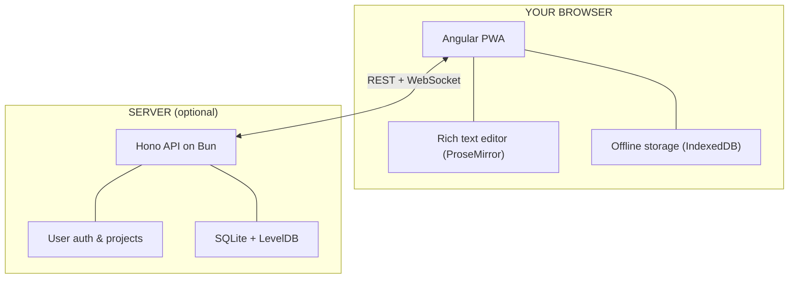

<p align="center">
  
</p>

<h1 align="center">Inkweld</h1>

<p align="center">
  <strong>Self-hosted collaborative writing platform for novelists & worldbuilders</strong><br>
  Your words, your server, your control.
</p>

<p align="center">
  <a href="#quick-start">Quick Start</a> •
  <a href="#features">Features</a> •
  <a href="#status">Status</a> •
  <a href="#architecture">Architecture</a> •
  <a href="#development">Development</a> •
  <a href="#contributing">Contributing</a>
</p>

<p align="center">
  <a href="LICENSE"></a>
  <a href="https://github.com/bobbyquantum/inkweld/actions"></a>
  <a href="https://github.com/bobbyquantum/inkweld/pkgs/container/inkweld"></a>
</p>

---

## Quick Start

Coming soon, once first numbered release is added.

📖 **[Full deployment guide →](DEPLOY.md)**

---

## Features

**Write together, or alone.** Jump in on any device with the real time sync server, or collaborate in real-time with other writers, or work entirely locally with no server. 

**Build your world as you write.** Create characters, locations, factions — whatever your story needs. Link them together with relationships, and reference them directly in your prose with @mentions.

**Own your data.** Many hosting options are supported.  Native sync server binaries (thanks to Bun), self contained Docker images, and support for Cloudflare free tier deployment.

**Export when you're ready.** PDF, EPUB, Markdown, HTML. Configurable publish plans let you publish multiple asset variants from a single project.

📋 **[Full feature roadmap →](#feature-roadmap)**

---

## Status

### Unreleased 

- Can be deployed and used now, however, until numbered releases are started, there are no guarantees that data migration paths will be available.  
- Not recommended for production use.   If you do use it in this way, always back up your work before upgrading, and be aware, manual fixing of exports might be needed to move to newer versions.  
- At some point closer to the first numbered release, the drizzle migrations will be squashed into a single V1 migration, meaning existing databases will need to be reset or manually fixed.  


---

## Feature Roadmap

**Status:** ✅ Done | 🔨 In Progress | ⬜ Planned  
**Priority:** 🔥 High | 🟡 Medium | 🟢 Nice to have

### Project Management
|  |  | Feature | Notes |
|--|--|---------|-------|
| ✅ | 🔥 | Home screen with project cards | Browse and manage all projects |
| ✅ | 🔥 | Drag-and-drop project tree | Organize documents, folders, elements |
| ✅ | 🔥 | Folder hierarchy | Unlimited nesting depth |
| ✅ | 🔥 | Project archives (import/export) | Backup and restore entire projects |
| ✅ | 🟡 | Project renaming | |
| ✅ | 🟡 | Context menus | Right-click actions on tree items |
| ✅ | 🟡 | Home screen search | Filter projects by name |
| ✅ | 🟡 | Project templates | Start new projects from templates |
| ✅ | 🟢 | Project duplication | Export & re-import with new name |

### Search & Navigation
|  |  | Feature | Notes |
|--|--|---------|-------|
| ✅ | 🔥 | Quick file open (Ctrl/Cmd + P) | |
| ✅ | 🔥 | Find in document (Ctrl/Cmd + F) | |
| ✅ | 🔥 | Mobile-responsive design | |
| ✅ | 🔥 | Project-wide search (Ctrl/Cmd + Shift + F) | Full-text search across all documents |
| ✅ | 🔥 | Find and replace in document | |
| ✅ | 🟡 | Tag filtering in search | Filter search results by tags, element types, relationships, and worldbuilding schemas |
| ⬜ | 🟡 | Tag filtering in project tree | Show/hide elements by tag |
| ⬜ | 🟡 | Breadcrumbs | Show path to current document |
| ⬜ | 🟡 | Favorites/Bookmarks | Quick access to key elements |
| ✅ | 🟢 | Recent files list | Tracks last 10 files per project |

### Writing Tools
|  |  | Feature | Notes |
|--|--|---------|-------|
| ✅ | 🔥 | Full keyboard shortcut support | |
| ✅ | 🔥 | Image insertion | |
| ✅ | 🟡 | Zen mode (distraction-free) | |
| ✅ | 🟡 | Document snapshots | Version history for documents |
| ⬜ | 🟡 | Comments/Annotations | Inline feedback for collaborators |
| ⬜ | 🟢 | Writing statistics | Daily/weekly word counts, session stats, goals |

### Worldbuilding
|  |  | Feature | Notes |
|--|--|---------|-------|
| ✅ | 🔥 | Custom element templates | |
| ✅ | 🔥 | Relationships with backlinks | Bidirectional connections |
| ✅ | 🔥 | Element references (@mentions) | |
| ✅ | 🟡 | Tags on documents & elements | Categorize and organize content |
| ⬜ | 🟡 | Tags on images | Extend tagging to media library |
| ⬜ | 🟡 | Random generators | Names, locations, prompts for inspiration |
| ⬜ | 🟡 | Custom calendar systems | Fantasy calendars with custom months/years |
| ⬜ | 🟢 | Language/Conlang tools | Vocabulary lists, alphabets |
| ⬜ | 🟢 | Secrets/GM notes | Per-element spoiler hiding from some collaborators |
| ⬜ | 🟢 | Reference images panel | Side-by-side images while writing |

### Media Library
|  |  | Feature | Notes |
|--|--|---------|-------|
| ✅ | 🔥 | Local-first image storage | Saved to IndexedDB, syncs to server |
| ✅ | 🔥 | Inline image embedding | Paste/drop images into documents |
| ✅ | 🟡 | Cover images | Project and element covers |
| ✅ | 🟡 | Category filtering | Filter by generated, inline, published, etc. |
| ✅ | 🟡 | Server sync | Bi-directional sync when connected |
| ⬜ | 🟡 | Image search/filtering | Search within media library |
| ⬜ | 🟢 | Bulk image operations | Multi-select, batch delete |

### Collaboration
|  |  | Feature | Notes |
|--|--|---------|-------|
| ✅ | 🔥 | Real-time co-editing | Multiple users editing same document |
| ✅ | 🔥 | CRDT conflict resolution | Yjs-based, no manual merge needed |
| ✅ | 🔥 | Presence indicators | See who's viewing/editing |
| ✅ | 🔥 | Collaborative cursors | See other users' cursor positions |
| ✅ | 🟡 | Project sharing | Invite collaborators with role-based access |
| ✅ | 🟡 | Local-first architecture | Works offline, syncs when connected |
| ✅ | 🟡 | Migrate local to server | Start offline, add sync server later |
| ⬜ | 🟢 | Activity feed | See recent changes by collaborators |


### Relationship Charts
|  |  | Feature | Notes |
|--|--|---------|-------|
| ✅ | 🔥 | Relationship chart element | New element type for visualizing connections |
| ✅ | 🔥 | Graph layout | Force-directed network visualization |
| ⬜ | 🟡 | Hierarchy layout | Tree-style parent/child visualization |
| ✅ | 🟡 | Relationship type filtering | Choose which relationship types to include |
| ✅ | 🟡 | Element type filtering | Choose which element types to include |
| ✅ | 🟢 | Export chart as image | PNG/SVG export |

### Canvas

|  |  | Feature | Notes |
|--|--|---------|-------|
| ✅ | 🔥 | Canvas element type | Infinite freeform canvas with layers |
| ✅ | 🔥 | Drawing tools | Freehand draw, line, shapes (rect, ellipse, arrow), text, pin |
| ✅ | 🔥 | Image placement | Add and position images on the canvas |
| ✅ | 🟡 | Layers | Add, rename, duplicate, delete; visibility & lock toggles |
| ✅ | 🟡 | Pan and zoom | Navigate large canvases smoothly |
| ✅ | 🟡 | Export as PNG | Standard and high-resolution export |
| ⬜ | 🟡 | Shape fills & stroke palette | Per-object color editing |
| ⬜ | 🟢 | Pin-to-element linking | Connect canvas pins to worldbuilding elements |

### Interactive Maps

|  |  | Feature | Notes |
|--|--|---------|-------|
| ⬜ | 🔥 | Map background images | Load a map image as a non-editable canvas background |
| ⬜ | 🔥 | Location pins | Clickable markers linked to worldbuilding elements |
| ⬜ | 🔥 | Pin-to-element linking | Special relationship type connecting pins to elements |
| ⬜ | 🟡 | Multiple map layers | Overlay different maps (political, terrain, etc.) |

### Timelines
|  |  | Feature | Notes |
|--|--|---------|-------|
| ⬜ | 🔥 | Timeline element type | New element for chronological visualization |
| ⬜ | 🔥 | Time systems | Define custom calendars and date formats |
| ⬜ | 🔥 | Timeline fields on elements | Add dates to worldbuilding elements |
| ⬜ | 🔥 | Auto-build from elements | Generate timeline from element date fields |
| ⬜ | 🟡 | Events system | Add events directly to timeline with element references |
| ⬜ | 🟡 | Multiple timelines | Parallel timelines for different storylines/regions |
| ⬜ | 🟢 | Era/period grouping | Visual spans for ages, reigns, wars |

### Publishing
|  |  | Feature | Notes |
|--|--|---------|-------|
| ✅ | 🔥 | EPUB export | Industry-standard e-book format |
| ✅ | 🔥 | PDF export (via Typst) | Print-ready documents |
| ✅ | 🔥 | Markdown export | Plain text with formatting |
| ✅ | 🔥 | HTML export | Single-file web output |
| ✅ | 🟡 | Publish plans | Save export configurations for reuse |
| ⬜ | 🟡 | Typography customization | Print formatting options |

### Auth & Security
|  |  | Feature | Notes |
|--|--|---------|-------|
| ✅ | 🔥 | Password auth | Strong client-side requirements; backend enforces 6-char minimum only |
| ✅ | 🔥 | CSRF protection | |
| ✅ | 🟡 | User approval system | |
| ⬜ | 🔥 | Password reset via email | |
| ⬜ | 🟡 | OAuth providers | |
| ⬜ | 🟡 | Two-factor auth | |

### DevOps & Admin
|  |  | Feature | Notes |
|--|--|---------|-------|
| ✅ | 🔥 | Docker with multi-stage builds | |
| ✅ | 🔥 | Docker Compose | |
| ✅ | 🔥 | CI/CD with automated testing | |
| ✅ | 🟡 | Auto-publish to GHCR | |
| ✅ | 🟡 | Admin dashboard | User management, AI settings, announcements |
| ⬜ | 🟡 | Production logging | |
| ⬜ | 🟢 | Monitoring setup | |

### Documentation
|  |  | Item | Notes |
|--|--|------|-------|
| ⬜ | 🟡 | Features marketing page | `/features` landing page for website |
| ⬜ | 🟡 | Import/archive docs | User guide for importing projects |
| ✅ | 🟢 | Desktop app docs | Electron app installation guide |

### Optional AI Features
> All AI features require admin configuration and are disabled by default. See [AI Stance](#ai-stance).

|  |  | Feature | Notes |
|--|--|---------|-------|
| ✅ | 🟡 | AI image generation | OpenAI, OpenRouter, Fal.ai, Stable Diffusion |
| ✅ | 🟡 | Image model profiles | Admin-configured presets per provider/model |
| ✅ | 🟡 | Worldbuilding context for images | Include element data in generation prompts |
| ✅ | 🟡 | Reference images | Use existing images as style/composition reference |
| ✅ | 🟡 | Prompt optimization | AI-powered prompt rewriting for better results |
| 🔨 | 🟡 | AI grammar/lint suggestions | Implemented but currently broken — needs fixing |
| ⬜ | 🟢 | AI writing assistance | Suggestions, continuations, rephrasing |

---

## Architecture

Inkweld has two parts that can run together or separately:



**The client** is where you write. It's a full web app that works offline.

**The server** enables sharing and sync. Run it on your own hardware or a VPS. Without it, you can still use Inkweld locally — documents save to your browser.

---

## Development

### Requirements

- [Bun 1.3+](https://bun.sh/)
- [Node.js 22+](https://nodejs.org/)

### Setup

```bash
git clone https://github.com/bobbyquantum/inkweld.git
cd inkweld
bun install
cp .env.example .env
npm start
```

Frontend runs on `:4200`, backend on `:8333`.

### Commands

| Task | Command |
|------|---------|
| Dev servers | `npm start` |
| Run tests | `npm test` |
| Build | `npm run build` |
| Docker | `npm run compose:up:prod` |

📖 **[Developer docs →](docs/GETTING_STARTED.md)**

---

## Data Security & AI Stance

Inkweld is self-hosted — the content on your server doesn't leave your server and any browsers you connect with.  

The exception to this are if you use external AI services.  There's an **AI Kill Switch** that disables all AI features, and AI is disabled by default.   

If you choose to enable AI features, you can configure both self hosted services and external services, and uses include image generation based on content, and grammar suggestions.  

You should be aware when using external AI services that content could be used to train, and in the case of some providers, even be published or sold as training data sets.

> Always check the provider policies when configuring AI features.

## AI Usage Disclosure

**Disclosure:** GitHub Copilot and Claude Code is used in development (a lot). The desktop background image in the main app is currently AI-generated.  Some of the examples in the docs use generative AI for images and text. 

The main logo is not AI, this was hand-drawn in Inkscape as SVG.

---

## Contributing

Check out the [Production Readiness Checklist](#status) for areas that need work.

- 🐛 [Report bugs](https://github.com/bobbyquantum/inkweld/issues)
- 💡 [Request features](https://github.com/bobbyquantum/inkweld/discussions)
- 🔧 [Submit PRs](https://github.com/bobbyquantum/inkweld)

---

## License

MIT — see [LICENSE](LICENSE).
