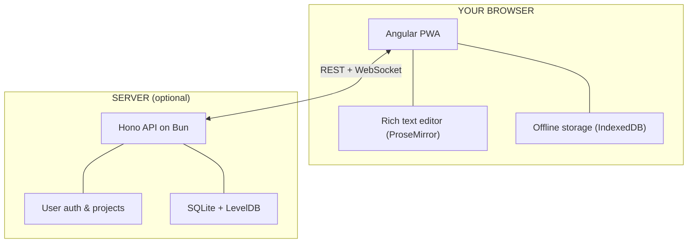

<p align="center">
  
</p>

<h1 align="center">Inkweld</h1>

<p align="center">
  <strong>Self-hosted collaborative writing platform for novelists & worldbuilders</strong><br>
  Your words, your server, your control.
</p>

<p align="center">
  <a href="#quick-start">Quick Start</a> •
  <a href="#features">Features</a> •
  <a href="#status">Status</a> •
  <a href="#architecture">Architecture</a> •
  <a href="#development">Development</a>
</p>

<p align="center">
  <a href="LICENSE"></a>
  <a href="https://github.com/bobbyquantum/inkweld/actions"></a>
  <a href="https://github.com/bobbyquantum/inkweld/pkgs/container/inkweld"></a>
</p>

---

## Quick Start

Coming soon.

📖 **[Full deployment guide →](DEPLOY.md)**

---

## Features

**For Writers**
- Real-time collaboration — multiple people editing the same document
- Offline-first — write anywhere, sync when you reconnect
- Export to PDF, EPUB, and Markdown

**For Worldbuilders**
- Customizable element types (characters, locations, items, etc.)
- Relationship systems between elements
- Cross-reference elements directly in your documents

**For Self-Hosters**
- Single Docker image, everything included
- SQLite database, no external dependencies
- Your data stays on your machine

---

## Status

> Unreleased. Core features work, rough edges remain.

| Area | Status | Notes |
|------|--------|-------|
| ✅ Core Editing | Ready | ProseMirror + Yjs, real-time sync, offline support |
| ✅ Worldbuilding | Ready | Custom templates, relationships, element references |
| ✅ Export | Ready | PDF, EPUB, Markdown, project archives |
| 🔨 User Experience | In Progress | Quick-open works, search & navigation coming |
| 🔨 Editor Polish | In Progress | Shortcuts done, images & code blocks coming |
| 🔨 Auth & Security | In Progress | Basic auth + CSRF done, OAuth & 2FA planned |
| 🔨 DevOps | In Progress | Docker & CI done, monitoring planned |
| 📋 Project Structure | Planned | Templates for contributing, security policy |
| 📋 Admin Tools | Planned | Dashboard, analytics |

<details>
<summary><strong>Full checklist</strong></summary>

### Core Functionality ✅
- ✅ Document editing with ProseMirror + Yjs
- ✅ Local-first with automatic sync
- ✅ Browser IndexedDB + server LevelDB storage
- ✅ Worldbuilding elements with custom templates
- ✅ Real-time collaboration via WebSocket
- ✅ Import/export project archives
- ⬜ Project renaming

### Export ✅
- ✅ EPUB export
- ✅ PDF export (via Typst)
- ✅ Markdown export
- ⬜ Print formatting options
- ⬜ Typography customization

### User Experience 🔨
- ✅ Quick file open (Ctrl/Cmd + P)
- ✅ Find in document (Ctrl/Cmd + F)
- ✅ Mobile-responsive design
- ⬜ Project-wide search
- ⬜ Find and replace
- ⬜ Breadcrumbs, favorites, recent files

### Editor 🔨
- ✅ Full keyboard shortcut support
- ⬜ Image insertion
- ⬜ Code blocks

### Auth & Security 🔨
- ✅ Password auth with strong requirements
- ✅ CSRF protection
- ✅ User approval system
- ⬜ Password reset via email
- ⬜ OAuth providers
- ⬜ Two-factor auth

### DevOps 🔨
- ✅ Docker with multi-stage builds
- ✅ Docker Compose
- ✅ CI/CD with automated testing
- ✅ Auto-publish to GHCR
- ⬜ Production logging
- ⬜ Monitoring setup

</details>

---

## Architecture

Inkweld has two parts that can run together or separately:



**The client** is where you write. It's a full web app that works offline.

**The server** enables sharing and sync. Run it on your own hardware or a VPS. Without it, you can still use Inkweld locally — documents save to your browser.

---

## Development

### Requirements

- [Bun 1.3+](https://bun.sh/)
- [Node.js 20+](https://nodejs.org/)

### Setup

```bash
git clone https://github.com/bobbyquantum/inkweld.git
cd inkweld
bun install
cp .env.example .env
npm start
```

Frontend runs on `:4200`, backend on `:8333`.

### Commands

| Task | Command |
|------|---------|
| Dev servers | `npm start` |
| Run tests | `npm test` |
| Build | `npm run build` |
| Docker | `npm run compose:up:prod` |

📖 **[Developer docs →](docs/GETTING_STARTED.md)**

---

## AI Stance

Inkweld is self-hosted — the content on your server doesn't leave your server and any browsers you connect with.  

The only exceptions to this are if you use external AI services.  There's an **AI Kill Switch** that disables all AI features, and AI is disabled by default.   If you choose to enable AI features, you can connect to self hosted services, or external services, and uses include image generation based on content, and grammar suggestions.

**Disclosure:** GitHub Copilot and Claude Code is used in development (a lot). The desktop background image in the main app is currently AI-generated.  Some of the examples in the docs use generative AI for images and text. 

The main logo is not AI, this was hand-drawn in Inkscape as SVG.

---

## Contributing

Check out the [Production Readiness Checklist](#status) for areas that need work.

- 🐛 [Report bugs](https://github.com/bobbyquantum/inkweld/issues)
- 💡 [Request features](https://github.com/bobbyquantum/inkweld/discussions)
- 🔧 [Submit PRs](https://github.com/bobbyquantum/inkweld)

---

## License

MIT — see [LICENSE](LICENSE).
