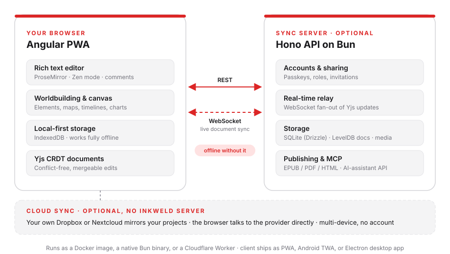

<p align="center">
  
</p>

<h1 align="center">Inkweld</h1>

<p align="center">
  <strong>Self-hosted collaborative writing platform for novelists & worldbuilders</strong><br>
  Your words, your server, your control.
</p>

<p align="center">
  <a href="#quick-start">Quick Start</a> •
  <a href="#features">Features</a> •
  <a href="#status">Status</a> •
  <a href="#architecture">Architecture</a> •
  <a href="#development">Development</a> •
  <a href="#contributing">Contributing</a>
</p>

<p align="center">
  <a href="LICENSE"></a>
  <a href="https://github.com/bobbyquantum/inkweld/actions"></a>
  <a href="https://github.com/bobbyquantum/inkweld/pkgs/container/inkweld"></a>
</p>

---

## Quick Start

```bash
# Pull and run with Docker
docker run -d \
  --name inkweld \
  -p 8333:8333 \
  -e HOST=0.0.0.0 \
  -e SESSION_SECRET=$(openssl rand -hex 32) \
  -e WEBAUTHN_RP_ID=your-domain.com \
  -e ALLOWED_ORIGINS=https://your-domain.com \
  -v inkweld_data:/data \
  ghcr.io/bobbyquantum/inkweld:latest
```

Then open `http://localhost:8333` in your browser.

📖 **[Full deployment guide →](DEPLOY.md)**

---

## Features

**Write together, or alone.** Work entirely in your browser with no server, keep writing across your devices through your own cloud storage, or connect to an Inkweld server for real-time collaboration.

**Build your world as you write.** Create characters, locations, factions — whatever your story needs. Link them together with relationships, and reference them directly in your prose with @mentions.

**Own your data.** Many hosting options are supported.  Native sync server binaries (thanks to Bun), self contained Docker images, and support for Cloudflare free tier deployment.

**Export when you're ready.** PDF, EPUB, Markdown, HTML. Configurable publish plans let you publish multiple asset variants from a single project.

### Three ways to use it

| | Browser | Cloud Sync | Realtime Sync |
|---|:---:|:---:|:---:|
| Where your writing lives | This browser only | Your own Dropbox or Nextcloud | An Inkweld server |
| Account needed | None | Your cloud provider account | Inkweld account on that server |
| Works offline | ✅ | ✅ (syncs when back online) | ✅ (syncs when back online) |
| Use on several devices | ⬜ | ✅ | ✅ |
| Real-time co-editing, presence, cursors | ⬜ | ⬜ | ✅ |
| Share projects with collaborators | ⬜ | ⬜ | ✅ |
| Version history & snapshots | ✅ local | ✅ synced | ✅ synced |
| Media library & covers | ✅ | ✅ | ✅ |
| Publishing (PDF, EPUB, HTML…) | ✅ | ✅ | ✅ |
| AI features, MCP for AI assistants | ⬜ | ⬜ | ✅ (if the server enables them) |
| Backup | Export archive | Continuous mirror + export archive | Server + export archive |
| Move to another mode later | ✅ | ✅ | ✅ |
| Cost to run | Free | Free (your storage quota) | Self-host, or a hosted server |

📋 **[Full feature list →](#feature-list)** · 🗺️ **[Roadmap →](ROADMAP.md)**

---

## Status

### 1.0 beta

- Inkweld is feature complete for 1.0 and in beta: the focus until 1.0.0 is testing and bug fixing. Please report problems on the [issue tracker](https://github.com/bobbyquantum/inkweld/issues).
- Releases follow [Semantic Versioning](https://semver.org/), and the [changelog](CHANGELOG.md) lists what changed in each one.
- Docker images are tagged per release: `ghcr.io/bobbyquantum/inkweld:1.0.0-beta.1` and so on, plus `:beta` for the newest beta. `:latest` follows the betas until 1.0.0 and stable releases after it; `:dev` follows `main`.
- **From 1.0.0-beta.1 on, there is always an automatic upgrade path.** Any release can be upgraded to any later release without exporting and re-importing your work: the Docker/Bun server migrates its database on start (Cloudflare deployments with `wrangler d1 migrations apply`), the app upgrades the data it keeps on your device, and project archives exported by any release stay importable. Back up before upgrading all the same.
- Builds from before 1.0.0-beta.1 had no such promise. The database migrations were squashed into a single baseline for 1.0: a database that was fully migrated before the squash (commit `a49deaef`) upgrades cleanly; an older one must first be started on a build from just before the squash so its remaining migrations run, or be reset.

### 📱 Android beta testers wanted

The Inkweld Android app is in closed testing on Google Play, and it needs testers before it can be published. If you have an Android phone and would like to help:

1. Join the [Inkweld testers group](TODO-GOOGLE-GROUP-URL) with the Google account you use on Play.
2. Opt in at <https://play.google.com/apps/testing/app.inkweld>, then install Inkweld from the Play Store.
3. Keep it installed and use it for a couple of weeks. Report anything that breaks on the [issue tracker](https://github.com/bobbyquantum/inkweld/issues).

---

## Feature List

Everything below ships in 1.0. Planned features live in the [roadmap](ROADMAP.md).

- **Projects:** home screen with covers, search, sorting and pinning; drag-and-drop project tree with unlimited folder nesting; project templates; rename; archives (`.inkweld.zip`) to back up, restore or duplicate a project.
- **Writing:** rich-text editor with tables, images, links and keyboard shortcuts; scenes and notes with synopsis, status and word targets; corkboard and outline views of a folder; find and replace; zen mode; snapshots (named and automatic); threaded comments; writing statistics.
- **Search and navigation:** quick open (Ctrl/Cmd+P), find in document (Ctrl/Cmd+F), project-wide full-text search (Ctrl/Cmd+Shift+F) with tag, type, relationship and template filters; breadcrumbs; pinned items; recent files; mobile-friendly layout.
- **Worldbuilding:** templates for characters, places, factions and more, edited in a live template editor, with per-element customisation; relationships with backlinks; @mentions in prose; tags; custom calendars; random name, place and prompt generators.
- **Media library:** images stored on the device and synced to the server; paste or drop images into documents; project and element covers; filtering, search and tags.
- **Collaboration:** real-time co-editing with presence and cursors; sharing with viewer and editor roles; offline-first with sync on reconnect; move a project from browser-only to a server later; activity feed.
- **Relationship charts:** graph and hierarchy layouts, filtered by relationship and element type, exported as PNG or SVG.
- **Canvas and maps:** layered freeform canvas with drawing tools, shapes, text, images and gradient fills; pan, zoom and touch support; size and crop frames exported as PNG/SVG or used as the project cover; interactive maps with background images, pins and regions linked to elements.
- **Timelines:** custom time systems, eras, events, and timelines built automatically from element dates.
- **Publishing:** publish plans for EPUB, PDF (Typst), Markdown, HTML and a multi-page website, with typography presets and per-section style overrides.
- **Accounts and security:** passkeys by default, with optional magic-link recovery, passwords (with email reset) and GitHub sign-in; user approval; CSRF protection and a Content-Security-Policy.
- **Administration:** admin dashboard for users, settings, AI providers and announcements; custom branding and legal pages; per-user storage quotas; production logging.
- **Self-hosting:** Docker image and Compose, native Bun server, or Cloudflare Workers; Home Assistant app; Android app; Electron desktop build.
- **Optional AI features** (configured by an admin, off by default; see [AI stance](#data-security--ai-stance)): image generation (OpenAI, OpenRouter, Fal.ai, Stable Diffusion) with model profiles, worldbuilding context and reference images; prompt optimisation; grammar and style suggestions; an MCP server for AI assistants.

---

## Architecture

Inkweld has two parts that can run together or separately, plus an optional Cloud Sync mode that needs neither an Inkweld server nor an account:

<p align="center">
  <picture>
    <source media="(prefers-color-scheme: dark)" srcset="assets/architecture-dark.svg">
    
  </picture>
</p>

**The client** is where you write. It's a full web app that works offline.

**The server** enables real-time collaboration and sharing. Run it on your own hardware or a VPS. Without it, you can still use Inkweld locally — documents save to your browser.

**Cloud Sync** mirrors your projects to your own Dropbox or Nextcloud straight from the browser, so you can move between devices without running a server.

---

## Development

### Requirements

- [Bun 1.4+](https://bun.sh/)
- [Node.js 22+](https://nodejs.org/)

### Setup

```bash
git clone https://github.com/bobbyquantum/inkweld.git
cd inkweld
bun install
cp .env.example .env
npm run dev
```

Frontend runs on `:4200`, backend on `:8333`.

### Commands

| Task | Command |
|------|---------|
| Dev servers | `npm run dev` |
| Run tests | `npm test` |
| Build | `npm run build` |
| Docker (local) | `npm run docker:prod` |

📖 **[Developer docs →](docs/site/docs/getting-started.md)**

---

## Data Security & AI Stance

Inkweld is self-hosted — the content on your server doesn't leave your server and any browsers you connect with.  

The exception to this are if you use external AI services.  There's an **AI Kill Switch** that disables all AI features, and AI is disabled by default.   

If you choose to enable AI features, you can configure both self hosted services and external services, and uses include image generation based on content, and grammar suggestions.  

You should be aware when using external AI services that content could be used to train, and in the case of some providers, even be published or sold as training data sets.

> Always check the provider policies when configuring AI features.

## AI Usage Disclosure

**Disclosure:** GitHub Copilot and Claude Code is used in development (a lot). The desktop background image in the main app is currently AI-generated.  Some of the examples in the docs use generative AI for images and text. 

The main logo is not AI, this was hand-drawn in Inkscape as SVG.

---

## Contributing

Check out the [Status](#status) and the [Roadmap](ROADMAP.md) for areas that need work.

- 🐛 [Report bugs](https://github.com/bobbyquantum/inkweld/issues)
- 💡 [Request features](https://github.com/bobbyquantum/inkweld/discussions)
- 🔧 [Submit PRs](https://github.com/bobbyquantum/inkweld)

---

## License

MIT — see [LICENSE](LICENSE).
