# Inkweld


[](LICENSE)
[](https://github.com/bobbyquantum/inkweld/actions)
[](https://hub.docker.com/)
[](https://github.com/bobbyquantum/inkweld/pkgs/container/inkweld)

---

**Quick Links:**  
- [Getting Started](docs/GETTING_STARTED.md)  
- [API Documentation](server/openapi.json)  
- [CI/CD Pipeline](docs/CI_CD.md)  
- [Contributing](#contributing)  
- [Production Readiness Checklist](#production-readiness-checklist)

---

## About

Inkweld is ideal for:

- **Creative Writing**: Collaborate on novels, short stories, and screenplays with real-time editing and version control
- **Worldbuilding**: Organize and develop fictional worlds with hierarchical document structures
- **Technical Documentation**: Maintain up-to-date documentation with multiple contributors
- **Research Projects**: Collaborate on academic papers and research notes

### Feature Overview

| Feature                        | Description                                                                 |
|---------------------------------|-----------------------------------------------------------------------------|
| Real-time Collaboration        | Edit documents with others in real time using YJS and Prosemirror           |
| Hierarchical Organization      | Organize projects and documents in nested structures                        |
| Offline Editing                | Work offline with automatic sync when reconnected                           |
| Rich Text Formatting           | Advanced formatting and styling options                                     |
| Version History                | Track changes and revert to previous versions                               |
| User Permissions               | Fine-grained access control and roles                                       |
| Extensible Integrations        | Add new features via MCP (Model Context Protocol) integrations              |
| Export Options                 | (Planned) Export to PDF, EPUB, Markdown, and print-friendly formats         |

---

## Architecture

```mermaid
flowchart TD
    Frontend[Angular 19 PWA] -->|REST/HTTP| Backend[NestJS 10 Bun]
    Backend -->|OpenAPI spec| APIClient[Generated SDK]
    Frontend -.->|imports at build| APIClient
```



---

## Project Setup

> **Requirements:**  
> - [Bun 1.2+](https://bun.sh/)  
> - [NodeJS 20+](https://nodejs.org/en)

1. **Clone the repository:**
    ```bash
    git clone https://github.com/bobbyquantum/inkweld.git
    cd inkweld
    ```

2. **Install dependencies:**
    ```bash
    npm run install-all
    ```
    > This script installs dependencies for both the frontend and backend using the appropriate package managers.

3. **Set up environment variables:**
    - Copy `.env.example` to `.env` and update the values as needed.

> There are VSCode workspaces available. For general development or trying it out, it's recommended to load the full workspace with backend and frontend folders configured.

---

## Development Server

To start the development server (both frontend and backend):

```bash
npm start
```

There is also a compound debug task available.

---

## Build

To build the project:

```bash
npm run build
```

- Frontend build artifacts: `frontend/dist/`
- Backend build artifacts: `server/dist/`

---

## Docker Compose

To build and run with Docker Compose:

```bash
npm run compose:up:prod
```

---

## Docker Images

Pre-built Docker images are automatically published to GitHub Container Registry:

- **Latest (main branch)**: `ghcr.io/bobbyquantum/inkweld:latest`
- **Specific commit**: `ghcr.io/bobbyquantum/inkweld:main-<commit-sha>`
- **Release versions**: `ghcr.io/bobbyquantum/inkweld:v1.0.0`

### Using Pre-built Images

```bash
# Pull and run the latest image
docker run -p 8333:8333 ghcr.io/bobbyquantum/inkweld:latest

# Or use with docker-compose by updating your compose file:
# image: ghcr.io/bobbyquantum/inkweld:latest
```

### Available Tags

- `latest` - Latest stable build from main branch
- `v*` - Specific release versions (e.g., `v1.0.0`, `v1.1.0`)
- `main-<sha>` - Specific commit builds from main branch
- `manual` - Manual builds triggered via GitHub Actions

---

## Running Tests

To run tests for both frontend and backend:

```bash
npm test
```

This will execute the unit tests for both the frontend and backend projects.

---

## Production Readiness Checklist

### Core Functionality

- [x] Basic document editing with Prosemirror over YJS
- [x] In-browser IndexedDB storage
- [x] Backend LevelDB storage
- [ ] Complete import/export to archive functionality (partially done)
- [ ] Add project renaming and slug changing capabilities
- [ ] Implement templated worldbuilding features (character/location templates)
- [ ] Enhance collaborative editing features

### Content Export

- [ ] Implement PDF export functionality
- [x] Develop EPUB export capability
- [ ] Add Markdown export options
- [ ] Create print-friendly formatting

### User Experience

- [ ] Develop improved onboarding for first-time users
- [ ] Enable username changes and profile customization
- [ ] Enhance user dashboard/homepage
- [ ] Optimize responsive design for mobile devices
- [ ] Add MCP support for optional AI collaboration.

### Authentication & Security

- [x] Basic password authentication
- [x] GitHub OAuth integration
- [ ] Add additional OAuth providers beyond GitHub
- [ ] Implement enhanced security features
- [ ] Refine user permissions system
- [ ] Add session management capabilities

### Open Source Project Structure

- [ ] Create GitHub templates (issues, PRs, etc.)
- [ ] Develop comprehensive contributor documentation
- [ ] Add code of conduct and contribution guidelines
- [ ] Set up automated project boards

### DevOps & Deployment

- [x] Docker support with working Dockerfile
- [x] Docker Compose configuration
- [x] Support for SQLite and PostgreSQL databases
- [x] Basic CI that runs tests
- [x] Automated Docker image publishing
- [x] Multi-stage CI/CD pipeline
- [x] GitHub Container Registry integration
- [ ] Optimize Docker build process
- [ ] Develop self-hosting documentation
- [ ] Implement monitoring and logging

---

## Project View on AI and Creative Writing

This project aims to empower writers to make their own decisions regarding AI.

The software is designed to be self-hosted and secure. There are no backdoors, and it is not a publishing/distribution platform, so if you set up your own instance, your content will not be sold, scraped, borrowed, or stolen.

---

## Contributing

We welcome contributions! Please see [docs/CONTRIBUTING.md](docs/CONTRIBUTING.md) for guidelines (or create this file if it does not exist).  
- Open issues for bugs or feature requests.
- Submit pull requests for improvements.
- See the [Production Readiness Checklist](#production-readiness-checklist) for areas needing help.

---

## Community & Support

- [Discussions](https://github.com/bobbyquantum/inkweld/discussions) (or open an issue)
- For security concerns, please contact the maintainer directly.

---

## License

This project is licensed under the MIT License. See [LICENSE](LICENSE) for details.
