## System Architecture

Inkweld is a monorepo application with distinct frontend and backend services:


## Frontend (Angular 21)

### Technology Stack

- **Framework**: Angular 21 with standalone components
- **State Management**: Service-based with RxJS
- **Offline Storage**: IndexedDB via y-indexeddb
- **Real-Time**: Yjs + y-websocket provider
- **Editor**: ProseMirror with y-prosemirror binding
- **Build**: Angular CLI + Vite
- **Testing**: Vitest (unit) + Playwright (e2e)

### Modern Angular Patterns

```typescript
// Dependency injection with inject()
export class MyComponent {
  private projectService = inject(ProjectService);
  private router = inject(Router);
}

// Modern control flow
@if (project) {
  <app-editor [project]="project" />
} @else {
  <app-loading />
}

@for (item of items; track item.id) {
  <app-item [data]="item" />
}
```

### Key Services

- **ProjectStateService** - Central project state management
- **UnifiedProjectService** - Hybrid online/offline operations
- **DocumentService** - Yjs document lifecycle
- **WorldbuildingService** - Template/schema system
- **AuthService** - Authentication and session management

## Backend (Bun + Hono)

### Technology Stack

- **Runtime**: Bun (JavaScript runtime built for speed)
- **Framework**: Hono (lightweight web framework)
- **Database**: SQLite or D1 via Drizzle ORM
- **Document Storage**: LevelDB (per-project instances)
- **Real-Time**: Native WebSocket support
- **Testing**: Bun's built-in test runner

### API Architecture

```typescript
// Hono route example
app.get('/api/projects', authMiddleware, async (c) => {
  const user = c.get('user');
  const projects = await projectService.findByUser(user.id);
  return c.json(projects);
});

// WebSocket upgrade
app.get('/ws/:projectId', async (c) => {
  const projectId = c.req.param('projectId');
  return wsHandler.upgrade(c.req.raw, projectId);
});
```

### Key Modules

- **auth/** - Session-based authentication
- **routes/** - HTTP endpoints
- **services/** - Business logic layer
- **db/** - Drizzle ORM schema and database setup
- **durable-objects/** - (Cloudflare Workers deployment only)

## Real-Time Collaboration (Yjs)

### CRDT Technology

Yjs uses Conflict-free Replicated Data Types (CRDTs) to enable:

- **Concurrent editing** without conflicts
- **Eventual consistency** across all clients
- **Offline support** with automatic merging
- **Fine-grained updates** (character-level)

### Data Flow

```mermaid
%%{init: {'theme':'neutral'}}%%
graph TD
    User["👤 User Types"] --> PM["ProseMirror Editor"]
    PM --> YPM["y-prosemirror<br/>binding"]
    YPM --> YDoc["Yjs Document<br/>(CRDT)"]

    YDoc --> YWS["y-websocket<br/>(to server)"]
    YDoc --> YIdb["y-indexeddb<br/>(local cache)"]

    YWS --> WSServer["WebSocket Server"]
    WSServer --> YLevel["y-leveldb<br/>(persistence)"]

    style User fill:#e8f5e9,stroke:#2e7d32,stroke-width:2px
    style PM fill:#fff3e0,stroke:#f57c00,stroke-width:2px
    style YDoc fill:#e1f5fe,stroke:#0277bd,stroke-width:3px
    style YIdb fill:#fce4ec,stroke:#c2185b,stroke-width:2px
    style YLevel fill:#f3e5f5,stroke:#7b1fa2,stroke-width:2px
```



### Per-Project Storage

Each project gets its own LevelDB instance:

```mermaid
%%{init: {'theme':'neutral'}}%%
graph TD
    Data["📁 data/"]

    Data --> U1["👤 username1/"]
    Data --> U2["👤 username2/"]

    U1 --> P1["📂 project-slug/"]
    P1 --> L1["💾 leveldb/<br/>(Yjs documents)"]

    U2 --> P2["📂 another-project/"]
    P2 --> L2["💾 leveldb/<br/>(Yjs documents)"]

    style Data fill:#e3f2fd,stroke:#1565c0,stroke-width:2px
    style U1 fill:#f3e5f5,stroke:#7b1fa2,stroke-width:2px
    style U2 fill:#f3e5f5,stroke:#7b1fa2,stroke-width:2px
    style P1 fill:#fff3e0,stroke:#f57c00,stroke-width:2px
    style P2 fill:#fff3e0,stroke:#f57c00,stroke-width:2px
    style L1 fill:#e8f5e9,stroke:#2e7d32,stroke-width:2px
    style L2 fill:#e8f5e9,stroke:#2e7d32,stroke-width:2px
```



Benefits:

- **Isolation** - Projects don't interfere
- **Scalability** - Independent read/write operations
- **Cleanup** - Easy to delete project data
- **Connection pooling** - Automatic idle connection management

## Database Schema

### Drizzle ORM Schema


### Document Storage Architecture


## Authentication & Security


### Session-Based Auth

- **httpOnly cookies** for CSRF protection
- **Session store** backed by TypeORM
- **No JWT tokens** (intentional design choice)
- **Optional GitHub OAuth** (configurable)

### Security Measures

- **CORS** configuration via `ALLOWED_ORIGINS`
- **CSRF protection** on state-changing requests
- **Content Security Policy** headers
- **Rate limiting** (configurable)
- **User approval workflow** (optional)

## Deployment Targets

```mermaid
%%{init: {'theme':'neutral'}}%%
graph TB
    subgraph Dev[\"Development\"]
        DevBun[\"Bun Runtime<br/>Port 8333\"]
        DevNG[\"Angular CLI<br/>Port 4200\"]
    end

    subgraph Prod[\"Production Options\"]
        BunProd[\"🚀 Bun Server<br/>(Primary)\"]
        NodeProd[\"Node.js Server<br/>(Compatible)\"]
        Docker[\"🐳 Docker Container<br/>(Recommended)\"]
        CF[\"☁️ Cloudflare Workers<br/>(Experimental)\"]
    end

    subgraph Storage[\"Storage Backends\"]
        SQLite[(\"SQLite\")]
        D1[(\"D1 Database\")]
        R2[(\"R2 Storage\")]
    end

    BunProd --> SQLite
    NodeProd --> SQLite
    Docker --> SQLite
    CF --> D1
    CF --> R2

    style Dev fill:#e8f5e9,stroke:#2e7d32,stroke-width:2px
    style Prod fill:#e3f2fd,stroke:#1565c0,stroke-width:2px
    style Storage fill:#fff3e0,stroke:#f57c00,stroke-width:2px
    style BunProd fill:#bbdefb,stroke:#0d47a1,stroke-width:3px
    style Docker fill:#c8e6c9,stroke:#1b5e20,stroke-width:3px
```

### Bun (Primary)

```bash
bun run dev          # Development
bun run build        # Production build
bun run start        # Production server
```

### Node.js (Compatible)

```bash
bun run build:node   # Transpile for Node
node dist/node-runner.js
```

### Cloudflare Workers (Experimental)

```bash
bun run build:worker
npx wrangler deploy
```

Requires:

- Durable Objects for WebSocket persistence
- D1 database binding
- R2 for file storage (optional)

### Docker (Recommended for Production)

```bash
docker build -t inkweld .
docker run -p 8333:8333 -v inkweld_data:/data inkweld
```

Benefits:

- Single ~200MB image with frontend embedded
- Automatic migrations on startup
- Volume mounting for persistence
- Health check endpoint

## Build Pipeline

```mermaid
%%{init: {'theme':'neutral'}}%%
graph LR
    subgraph Dev[\"Development\"]
        DevStart[\"npm start\"]
        Concurrent[\"Concurrently\"]
        AngularDev[\"Angular CLI<br/>:4200\"]
        BunDev[\"Bun<br/>:8333\"]

        DevStart --> Concurrent
        Concurrent --> AngularDev
        Concurrent --> BunDev
    end

    subgraph Prod[\"Production Build\"]
        ProdBuild[\"Build Process\"]

        FEBuild[\"Frontend Build<br/>(Angular + Vite)\"]
        BEBuild[\"Backend Build<br/>(Bun optimize)\"]

        FEDist[\"frontend/dist/\"]
        BEDist[\"backend/dist/\"]

        ProdBuild --> FEBuild
        ProdBuild --> BEBuild
        FEBuild --> FEDist
        BEBuild --> BEDist
    end

    subgraph Docker[\"Docker Multi-Stage\"]
        Stage1[\"Stage 1:<br/>Frontend Build\"]
        Stage2[\"Stage 2:<br/>Backend Build\"]
        Stage3[\"Stage 3:<br/>Runtime Image\"]

        Stage1 --> Stage2
        Stage2 --> Stage3
    end

    style Dev fill:#e8f5e9,stroke:#2e7d32,stroke-width:2px
    style Prod fill:#fff3e0,stroke:#f57c00,stroke-width:2px
    style Docker fill:#e1f5fe,stroke:#0277bd,stroke-width:2px
```

### Development

```bash
npm start  # Runs both frontend and backend
```

Powered by:

- **Concurrently** to run multiple processes
- **Angular CLI** dev server (port 4200)
- **Bun** runtime (port 8333)

### Production

```bash
# Frontend
cd frontend
bun run build
bun run compress  # Optional

# Backend
cd backend
bun run build
```

Output:

- **frontend/dist/** - Angular production bundle
- **backend/dist/** - Bun-optimized backend code

### Docker Build

Multi-stage Dockerfile:

1. **Frontend build** stage (Node.js)
2. **Backend build** stage (Bun)
3. **Runtime** stage (minimal Bun image)
   - Copies frontend dist to static assets
   - Includes migrations for auto-run
   - Non-root user for security

## Testing Strategy

### Frontend Tests

```bash
npm test          # Vitest unit tests
npm run e2e       # Playwright e2e tests
```

- **Unit tests** with @ngneat/spectator
- **E2E tests** with fixtures (authenticatedPage, etc.)
- **Mock API** handlers in `e2e/mock-api/`
- **Screenshot tests** for visual regression

### Backend Tests

```bash
bun test
```

- **Unit tests** for services and utilities
- **Integration tests** for API endpoints
- **Supertest** for HTTP assertions
- **In-memory SQLite** for test isolation

## API Documentation

### OpenAPI Specification

Generated from code annotations:

```bash
cd backend
bun run generate:openapi
```

Output: `backend/openapi.json`

### Client Generation

Auto-generate TypeScript client for frontend:

```bash
cd backend
bun run generate:angular-client
```

Output: `frontend/src/api-client/`

**Never edit generated files manually.**

## Code Quality

### Linting

- **ESLint** with TypeScript support
- **Prettier** for formatting
- **Shared config** across frontend/backend

### Pre-commit Hooks

Consider adding:

- Lint-staged for fast checks
- Husky for Git hooks
- Prettier format check

### CI/CD

GitHub Actions workflow:

1. **Lint** all code
2. **Test** frontend and backend
3. **Build** Docker image
4. **Publish** to GHCR (on main branch)

## Performance Considerations

### Frontend

- **Lazy loading** for routes
- **OnPush change detection** where appropriate
- **Virtual scrolling** for long lists (consider)
- **Service Worker** for offline support

### Backend

- **LevelDB connection pooling** with automatic cleanup
- **Database indexing** on foreign keys
- **Pagination** for large result sets
- **WebSocket connection limits** (configurable)

### Real-Time

- **Debounced updates** for UI refresh
- **Incremental sync** (only changed content)
- **Efficient CRDT** merging via Yjs
- **Binary encoding** over WebSocket

## Development Workflow

### Workspace Structure

```mermaid
%%{init: {'theme':'neutral'}}%%
graph TD
    Root["📦 inkweld/"]

    Root --> FE["🎨 frontend/<br/>(Angular App)"]
    Root --> BE["⚡ backend/<br/>(Bun/Hono API)"]
    Root --> Docs["📚 docs/"]
    Root --> Assets["🖼️ assets/<br/>(Demo covers)"]
    Root --> PKG["📄 package.json<br/>(Root scripts)"]

    Docs --> Site["📖 site/<br/>(Docusaurus)"]

    FE --> FESrc["src/"]
    FE --> FEE2E["e2e/"]
    FE --> FETest["tests/"]

    BE --> BESrc["src/"]
    BE --> BETest["test/"]
    BE --> BEData["data/"]

    style Root fill:#e3f2fd,stroke:#1565c0,stroke-width:3px
    style FE fill:#fff3e0,stroke:#f57c00,stroke-width:2px
    style BE fill:#f3e5f5,stroke:#7b1fa2,stroke-width:2px
    style Docs fill:#e8f5e9,stroke:#2e7d32,stroke-width:2px
    style Assets fill:#fce4ec,stroke:#c2185b,stroke-width:2px
```



### NPM Scripts (Root)

```bash
bun install          # Install all dependencies
npm start            # Start dev servers
npm test             # Run all tests
npm run lint         # Lint all code
```

### Git Workflow

1. Create feature branch
2. Make changes + add tests
3. Run `npm test` and `npm run lint`
4. Open PR
5. CI validates
6. Merge to main

## Extensibility

### Custom Worldbuilding Templates

Define schemas in database:

```typescript
interface WorldbuildingSchema {
  name: string;
  tabs: SchemaTab[];
}

interface SchemaTab {
  title: string;
  fields: SchemaField[];
}
```

### Plugin System (Future)

Consider:

- Custom document types
- Export format plugins
- Theme customization
- Integration hooks (Discord, Slack)

## Next Steps

- Review [API documentation](/api)
- Read [deployment guide](../hosting/docker)
- Check the [user guide](../user-guide/projects)
- Explore the [features](../features)
