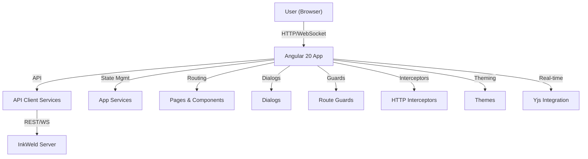

# InkWeld Frontend

## Overview

The InkWeld frontend is a modern, modular Angular 20 application designed to provide a rich, real-time collaborative writing experience. It serves as the client interface for the InkWeld platform, enabling users to create, edit, and manage writing projects with seamless integration of AI assistance and real-time collaboration.

## Key Features

- Real-time collaborative editing using Yjs and ProseMirror
- Modular architecture with standalone Angular 20 components
- Modern dependency injection using `inject()` syntax
- Comprehensive testing with Jest and Playwright
- Theming and customization support
- API client abstraction for backend communication
- Strict linting and formatting rules for code quality

## Architecture



## Directory Structure

- `src/app/`
  - `components/` – Shared UI components
  - `pages/` – Top-level routed pages
  - `dialogs/` – Dialog components
  - `services/` – Application and API services
  - `guards/` – Route guards
  - `interceptors/` – HTTP interceptors
  - `models/` – TypeScript interfaces and models
  - `pipes/` – Custom pipes
  - `config/` – App-wide configuration
  - `utils/` – Utility functions
  - `app.component.*` – Root component
  - `app.config.ts` – Standalone app configuration (providers, routes, etc.)
  - `app.routes.ts` – Route definitions
- `src/api-client/` – API client for backend communication
- `src/themes/` – Theming and style resources
- `src/testing/` – Test utilities and mocks
- `src/environments/` – Environment-specific configs

## Technology Stack

- **Framework:** Angular 20 (standalone components, `inject()` DI, control flow directives)
- **State Management:** Service-based with RxJS
- **Real-time Collaboration:** Yjs, y-websocket, y-prosemirror
- **Testing:** Jest (unit tests), Playwright (end-to-end tests)
- **Linting:** ESLint, Prettier, Angular ESLint
- **Build Tools:** Angular CLI, esbuild-visualizer
- **Theming:** Angular Material, custom themes

## Development Setup

### Prerequisites

- Node.js 18 or higher
- Package manager (npm, yarn, or bun)

### Installation

```bash
npm install
# or
bun install
```

### Running the Development Server

```bash
npm start
# or
bun run start
```

The app will be available at `http://localhost:4200/`.

### Building the Project

```bash
npm run build
# or
bun run build
```

Build artifacts will be output to the `dist/` directory.

### Running Tests

- Unit tests (Jest):

```bash
npm test
# or
bun test
```

- End-to-end tests (Playwright):

```bash
npm run e2e
# or
bun run e2e
```

### Linting

```bash
npm run lint
# or
bun run lint
```

To automatically fix lint issues:

```bash
npm run lint:fix
# or
bun run lint:fix
```

## Scripts

- `start` - Run development server
- `serve:prod` - Run production server
- `build` - Build project
- `watch` - Build in watch mode
- `test` - Run unit tests with Jest
- `lint` / `lint:fix` - Linting commands
- `analyze` - Bundle analysis
- `upgrade-angular` - Upgrade Angular dependencies to v19
- `fix-angular-control-flow` - Migrate to Angular control flow directives
- `e2e` - Run Playwright end-to-end tests

## Unique Technical Features

- Full adoption of Angular 20 standalone APIs and `inject()` for dependency injection
- Modern Angular control flow directives (`@if`, `@for`, `@switch`)
- Real-time collaborative editing with Yjs and ProseMirror
- Strict linting and formatting rules to maintain code quality
- Alias imports for cleaner and maintainable codebase

## Testing

- Jest configured with `jest-preset-angular`
- Coverage thresholds enforced (80% statements, functions, lines; 60% branches)
- Playwright for end-to-end testing
- Test utilities and mocks located in `src/testing/`

## Deployment

- Static build output in `dist/`
- Docker and Docker Compose support available (see root and server documentation for backend services)

## License

InkWeld is [MIT licensed](../LICENSE).
