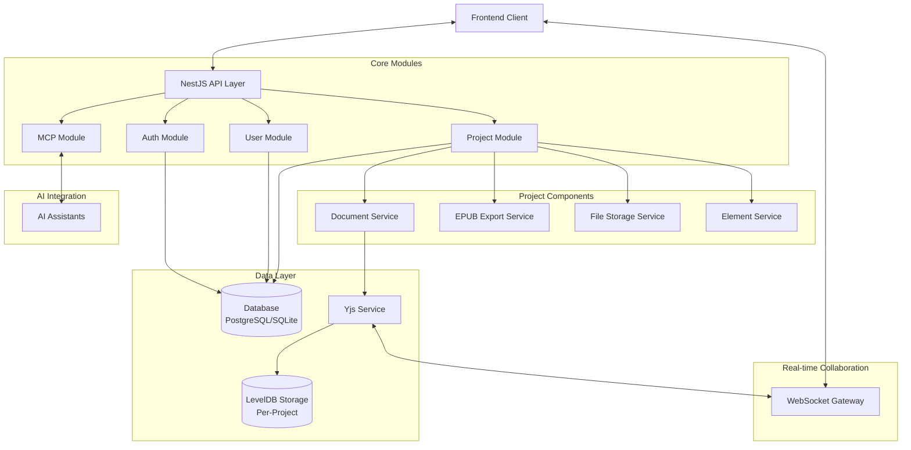

# InkWeld Server

<p align="center">
  
</p>

## Overview

InkWeld is a collaborative creative writing platform focused on novel writing and world building. It provides real-time collaboration capabilities, document management, and publishing features to help authors create, organize, and share their work.

## Key Features

- **Real-time Collaboration**: Multiple users can edit documents simultaneously using Yjs
- **Project Management**: Organize writing into projects with documents and elements
- **Document Versioning**: Track changes and maintain document history
- **EPUB Export**: Publish and export projects as EPUB files
- **Authentication**: Support for local and GitHub authentication strategies
- **AI Integration**: MCP (Model Context Protocol) support for connecting AI assistants

## Architecture

InkWeld server is built on a modular architecture with NestJS, with clear separation of concerns between different functional areas. Below is a visual representation of the system architecture:



### Key Architectural Components

1. **API Layer**: NestJS controllers for handling HTTP requests
2. **Core Modules**: Auth, User, Project, and MCP functionality
3. **Data Layer**: 
   - PostgreSQL/SQLite for structured data via TypeORM
   - LevelDB for per-project document data via y-leveldb
4. **Real-time Collaboration**: WebSocket gateway using Yjs for CRDT-based collaboration
5. **AI Integration**: MCP for connecting to AI assistants for context-aware help

## Technology Stack

- **Runtime**: [Bun](https://bun.sh/) - High-performance JavaScript runtime
- **Framework**: [NestJS](https://nestjs.com/) - Progressive Node.js framework
- **Database**: 
  - [TypeORM](https://typeorm.io/) with PostgreSQL or SQLite
  - [LevelDB](https://github.com/google/leveldb) via y-leveldb for document storage
- **Real-time Collaboration**: 
  - [Yjs](https://yjs.dev/) - CRDT framework for real-time collaboration
  - [y-websocket](https://github.com/yjs/y-websocket) - WebSocket adapter for Yjs
  - [y-leveldb](https://github.com/yjs/y-leveldb) - LevelDB adapter for Yjs
- **Authentication**: 
  - [Passport](https://www.passportjs.org/) - Authentication middleware
  - Session-based auth with TypeORM session store
- **API Documentation**: [Swagger/OpenAPI](https://swagger.io/)
- **AI Integration**: [Model Context Protocol](https://github.com/anthropics/model-context-protocol)

## Development Setup

### Prerequisites

- [Bun](https://bun.sh/) (>= 1.2.7)
- PostgreSQL or SQLite
- Node.js (>= 18.x) - Required for some NestJS CLI operations

### Installation

```bash
# Install dependencies
bun install

# Set up environment variables
cp .env.example .env
# Edit .env file with your configuration
```

### Environment Variables

InkWeld server can be configured using the following environment variables:

| Variable | Description | Default |
|----------|-------------|---------|
| `PORT` | Server port | 8333 |
| `DB_TYPE` | Database type (postgres/sqlite) | postgres |
| `DB_HOST` | Database host | localhost |
| `DB_PORT` | Database port | 5432 |
| `DB_USERNAME` | Database username | user |
| `DB_PASSWORD` | Database password | secret |
| `DB_NAME` | Database name | db |
| `DB_PATH` | SQLite database file path (if using SQLite) | ./sqlite.db |
| `SESSION_SECRET` | Secret for session cookies | fallback-secret |
| `ALLOWED_ORIGINS` | Comma-separated list of allowed CORS origins | |
| `GITHUB_ENABLED` | Enable GitHub authentication | false |
| `GITHUB_CLIENT_ID` | GitHub OAuth client ID | |
| `GITHUB_CLIENT_SECRET` | GitHub OAuth client secret | |
| `DATA_PATH` | Base path for project data | ./data |

### Running the Application

```bash
# Development mode
bun run start:dev

# Production mode
bun run start:prod

# Bun specific development with watch mode
bun run bun:dev
```

### Testing

```bash
# Unit tests
bun test

# End-to-end tests
bun run test:e2e

# Test coverage
bun run test:cov
```

## Project Structure

The server is organized into several modules, each with its own responsibility:

### Auth Module

Handles authentication and session management:
- Multiple authentication strategies (Local, GitHub)
- Session-based authentication with TypeORM session store
- CSRF protection

### User Module

Manages user accounts and profiles:
- User registration, authentication
- User profile management

### Project Module

Core module for managing writing projects:
- Project creation and management
- Document handling with real-time collaboration
- Element management for project components
- File storage for project assets
- EPUB export functionality

### MCP Module

Integrates with AI assistants using the Model Context Protocol:
- Provides tools for AI to interact with projects
- Enables contextual AI assistance for writing

## API Documentation

The server includes Swagger API documentation accessible at the `/api` endpoint when running. This provides a comprehensive overview of all available endpoints, request/response schemas, and allows for interactive API testing.

To generate updated OpenAPI documentation:

```bash
bun run generate:openapi
```

To generate an Angular client based on the OpenAPI specification:

```bash
bun run generate:angular-client
```

## Deployment

### Docker

InkWeld server can be deployed using Docker:

```bash
# Build the Docker image
docker build -t inkweld-server:prod -f Dockerfile .

# Run with Docker
docker run -p 8333:8333 inkweld-server:prod
```

### Docker Compose

For deployments with a database, use Docker Compose:

```bash
# Run with Docker Compose
docker-compose -f compose.prod.yaml up
```

## Unique Technical Features

### Per-Project LevelDB Storage

InkWeld uses a unique approach to document storage by creating separate LevelDB databases for each project. This provides:

- Isolation between projects
- Better scalability for large numbers of documents
- Simplified backup and restore operations per project
- Automatic cleanup of idle database connections

### Real-time Collaboration with Yjs

The document collaboration system is built on Yjs, providing:

- Conflict-free replicated data types (CRDTs)
- Offline editing capability
- Automatic conflict resolution
- Low-latency updates

### MCP Integration for AI Assistance

The Model Context Protocol integration allows:

- AI assistants to access project context
- Direct document updates from AI suggestions
- Contextual help based on the current project state

## License

InkWeld is [MIT licensed](LICENSE).
